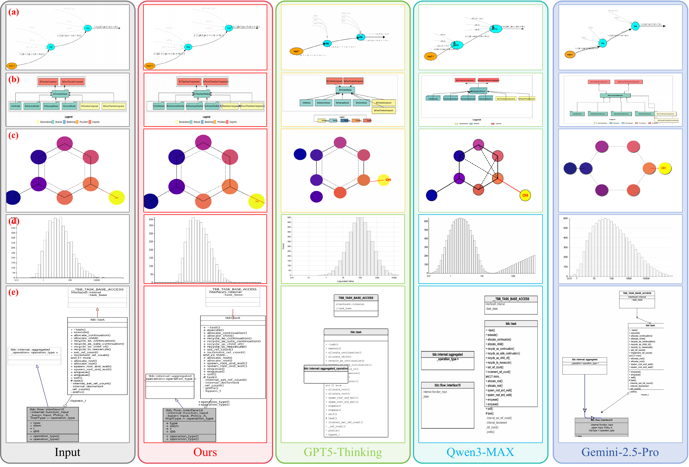

# Back2Struct: Making Structured Images Editable Again

<p align="center">
  <a href="https://arxiv.org/abs/XXXX.XXXXX"></a>
  <a href="https://pengyu965.github.io/Back2Struct.github.io/"></a>
  <a href="https://huggingface.co/Pengyu965/Back2Struct-Image2SVG-7B"></a>
  <a href="https://huggingface.co/datasets/Pengyu965/StructHub"></a>
</p>

<p align="center">
  <b>Pengyu Yan &nbsp;·&nbsp; Yixin Wu &nbsp;·&nbsp; Yunjie Tian &nbsp;·&nbsp; David Doermann</b><br>
  University at Buffalo, SUNY
</p>

> **Links:** [📄 Paper (arXiv — placeholder, updating soon)](https://arxiv.org/abs/XXXX.XXXXX) ·
> [🌐 Project Page](https://pengyu965.github.io/Back2Struct.github.io/) ·
> [🤖 Model](https://huggingface.co/Pengyu965/Back2Struct-Image2SVG-7B) ·
> [📚 Dataset](https://huggingface.co/datasets/Pengyu965/StructHub)



*Recovering the reference image across the most advanced LLMs — GPT-5 (Thinking), Qwen3-Max
(>1T params), Gemini-2.5-Pro — and **Back2Struct (ours)**. With only **7B parameters**,
Back2Struct reconstructs structured graphics with negligible confusion or mistakes.*

## Abstract

Structured images — diagrams, charts, and flowcharts — are inherently symbolic and can be
compactly represented in an editable format, yet in practice they are shared as raster
images and are no longer graphically editable. We present **Back2Struct**, which "makes
structured images editable again" by directly recovering vector graphics code (SVG / XML)
from image representations. Given an image of a structured graphic, Back2Struct predicts
semantically **object-level** SVG/XML that explicitly encodes text, shapes, topology, and
layout — rather than low-level pixel vectorization — so the code imports straight into tools
like PowerPoint to edit, restyle, and reuse while preserving structural fidelity. Beyond
supervised fine-tuning on ground-truth SVG token sequences, we optimize Back2Struct with
reward-based learning (a composite reward encouraging compilability, length consistency, and
structural/semantic similarity), improving accuracy, editability, validity, and user
alignment over strong baselines.

## Highlights

- **StructHub** — 84K paired structured raster images and their SVG/XML code, plus a
  1,000-sample evaluation benchmark.
- **Object-level recovery** — vector code that explicitly models text, shapes, topology, and
  layout (not pixels).
- **Reward-based optimization** — SFT then GRPO with a composite reward for deployment-time
  validity and faithfulness.

## Results

**StructHub benchmark (render-gated).** SR = render success (%); GPT = 0–100 GPTScore.

| Model | SR ↑ | DINO ↑ | LPIPS ↓ | SSIM ↑ | GPT ↑ |
|-------|-----:|-------:|--------:|-------:|------:|
| Qwen2.5-VL-7B (base) | 52.3 | 0.3527 | 0.7834 | 0.3276 | 27.56 |
| Qwen2.5-VL-7B (SFT) | 42.8 | 0.3715 | 0.7403 | 0.2891 | 33.49 |
| **Back2Struct (RL)** | **71.5** | **0.5622** | **0.6473** | **0.4966** | **51.85** |

**On successfully compiled outputs**, the 7B model matches or beats frontier closed models:

| Model | DINO ↑ | LPIPS ↓ | SSIM ↑ | GPT ↑ |
|-------|-------:|--------:|-------:|------:|
| Gemini-2.5-Pro | **0.8855** | 0.4648 | 0.6532 | 77.95 |
| GPT-5 | 0.8852 | 0.4350 | 0.6573 | 77.21 |
| **Back2Struct (7B)** | 0.8697 | **0.3896** | **0.6738** | **78.63** |

## Model & Dataset

- 🤖 **Model:** [`Pengyu965/Back2Struct-Image2SVG-7B`](https://huggingface.co/Pengyu965/Back2Struct-Image2SVG-7B) — Qwen2.5-VL-7B fine-tuned (SFT + GRPO) for image→SVG.
- 📚 **Dataset:** [`Pengyu965/StructHub`](https://huggingface.co/datasets/Pengyu965/StructHub) — `train` (86,102) + `benchmark` (1,000) splits, columns `image` / `svg` (+ `id`, `source`, `token_count`).

### Run the model
```python
import torch
from transformers import Qwen2_5_VLForConditionalGeneration, AutoProcessor
from qwen_vl_utils import process_vision_info

model_id = "Pengyu965/Back2Struct-Image2SVG-7B"
model = Qwen2_5_VLForConditionalGeneration.from_pretrained(
    model_id, torch_dtype=torch.bfloat16, device_map="auto")
processor = AutoProcessor.from_pretrained(model_id)

messages = [{"role": "user", "content": [
    {"type": "image", "image": "diagram.png"},
    {"type": "text",  "text": "Convert this structured image into editable SVG/XML code."},
]}]
text = processor.apply_chat_template(messages, tokenize=False, add_generation_prompt=True)
image_inputs, video_inputs = process_vision_info(messages)
inputs = processor(text=[text], images=image_inputs, videos=video_inputs,
                   padding=True, return_tensors="pt").to(model.device)
out = model.generate(**inputs, max_new_tokens=8192, do_sample=False)
print(processor.batch_decode(out[:, inputs.input_ids.shape[1]:], skip_special_tokens=True)[0])
```

### Load the dataset
```python
from datasets import load_dataset
ds = load_dataset("Pengyu965/StructHub")
ex = ds["benchmark"][0]
ex["image"].save("input.png"); print(ex["svg"][:500])
```

## Project page

This repository also hosts the project website — see [`index.html`](index.html), live at
**https://pengyu965.github.io/Back2Struct.github.io/**. Build/deploy notes are in
[`DEPLOY.md`](DEPLOY.md).

## Citation

```bibtex
@article{yan2026back2struct,
  title   = {Back2Struct: Making Structured Images Editable Again},
  author  = {Yan, Pengyu and Wu, Yixin and Tian, Yunjie and Doermann, David},
  year    = {2026},
  note    = {Preprint}
}
```
